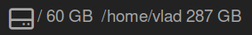

# awesome-disk-widget
A disk usage widget for Awesome WM



## features
* Display multiple disks

## install

1.Clone in your config directory (`~/.config/awesome/`)
```bash
cd ~/.config/awesome/
git clone https://github.com/davlord/awesome-disk-widget.git
```

2.Add to your wibar widgets (`~/.config/awesome/rc.lua`)

```lua
local disk_widget = require("awesome-disk-widget")

-- Add widgets to the wibox 
    s.mywibox:setup {
        layout = wibox.layout.align.horizontal,
        { -- Left widgets
            layout = wibox.layout.fixed.horizontal,
            mylauncher,
            s.mytaglist,
            s.mypromptbox,
        },
        s.mytasklist, -- Middle widget
        { -- Right widgets
            layout = wibox.layout.fixed.horizontal,
            disk_widget({mountpoints={"/","/home/jdoe"}}), -- <--HERE
            wibox.widget.systray(),
            mytextclock,
            s.mylayoutbox,
        },
    }
```
3. Reload Awesome WM
